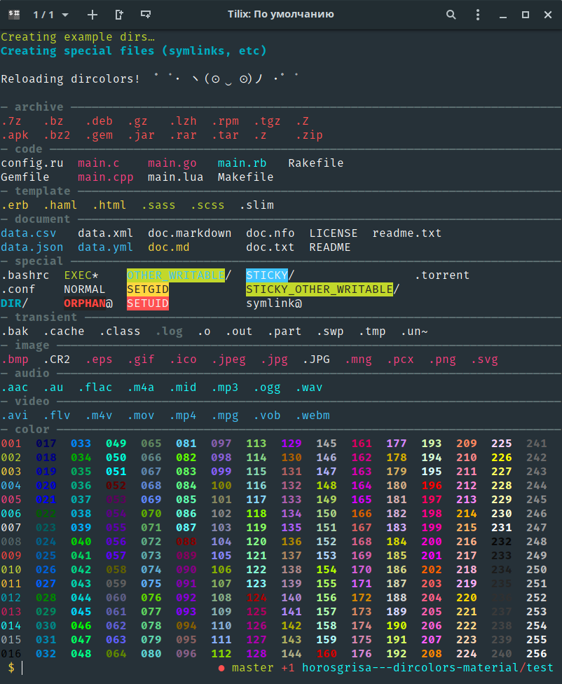

dircolors-material
====================

Dircolors material theme

## Installation

1. Download the latest
[dircolors.material](https://raw.github.com/zpm-zsh/dircolors-material/master/dircolors.material)
and put it in `$HOME/.dircolors` (which under Ubuntu will be loaded on login,
probably true for other distros as well)

2. Or use your zsh package manager, like [zpm](https://github.com/zpm-zsh/zpm): `zpm load zpm-zsh/dircolors-material`

## Terminal emulator configuration

For terminal emulator you need to use any material theme, example of used colors you cau see in `Material.json`, this file is a theme for Tilix


## Testing

Clone the repo to a machine running some kind of Linux, then `./run_test.sh`
(You will need bash 4.x installed on your machine)

It will then proceed to install (if missing) and use
[rerun](https://github.com/alexch/rerun/) in order to reload
`test.sh` each time `dircolors.*` or any `*.sh` is saved.

#### Arguments passed to rerun
```bash
rerun -x -b -p "**/{dircolors.*,*.sh}" -- ./test/test.sh
```

## test/test.sh

A simple Bash script that generates a bunch of files
and then lists them using the colors from `dircolors.jellybeans`


